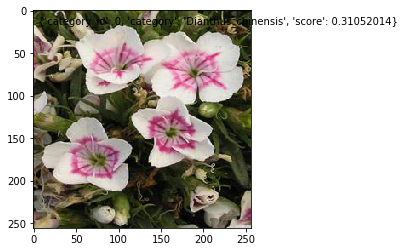

# [AI训练营]基于PaddleClas-ResNet50模型实现花卉名称识别

基于[ResNet50_vd_ssld](https://github.com/PaddlePaddle/PaddleX/blob/release/1.3/tutorials/train/image_classification/resnet50_vd_ssld.py)模型进行识别
项目地址：https://aistudio.baidu.com/aistudio/projectdetail/2275826?shared=1
数据集为：[data.zip](data.zip)和[data.z01](data.z01)（分卷）


### **飞桨图像分类套件 PaddleClas**
PaddleClas是飞桨为工业界和学术界所准备的一个图像分类任务百宝箱，助力使用者训练更好的视觉模型和应用落地。本教程简单介绍如何使用PaddleClas。

### **图像分类任务简介**
图像分类是根据图像的语义信息将不同类别图像区分开来，是计算机视觉中重要的基础任务。  
<center></center>     

# 一、项目背景
用户拍照上传图片，通过服务器计算对花卉名称进行简单的识别。

本例子，选用20种花卉进行简单的识别分类

```
初衷是找个比较好上手的场景来做项目，快速学习深度学习。

1.先做一个简单几种花卉的识别app，然后扩展到小程序。

2.扩展到更多的花卉，加大识别准确率和识别种类。
```

# 二、项目基本信息

<font size=5>**目录**</font>


├── data    &nbsp;&nbsp;&nbsp;&nbsp;&nbsp;&nbsp;&nbsp;&nbsp;&nbsp;&nbsp;&nbsp;&nbsp;&nbsp;&nbsp;&nbsp;&nbsp;&nbsp;&nbsp;&nbsp;&nbsp;&nbsp; //用于存放数据集

│   └── data103915

├── image     &nbsp;&nbsp;&nbsp;&nbsp;&nbsp;&nbsp;&nbsp;&nbsp;&nbsp;&nbsp;&nbsp;&nbsp;&nbsp;&nbsp;&nbsp;&nbsp;&nbsp;&nbsp;&nbsp;&nbsp;&nbsp;//花卉种类

│   ├── class_distribution.jpg    &nbsp;&nbsp;&nbsp;&nbsp;&nbsp;&nbsp;&nbsp;&nbsp;&nbsp;&nbsp;&nbsp;&nbsp;&nbsp;&nbsp;&nbsp;&nbsp;&nbsp;&nbsp;&nbsp;&nbsp;&nbsp;//种类分布图

│   ├── Dianthus_chinensis

│   ├── Digitalis_purpurea

│   ├── Echinacea

│   ├── Eschscholtzia

│   ├── Fritillaria

│   ├── Gardenia

│   ├── Gazania

│   ├── Jasminum

│   ├── labels.txt

│   ├── lancifolium

│   ├── Lycoris_radiata

│   ├── Matthiola

│   ├── Narcissus

│   ├── Nymphaea

│   ├── peach_blossom

│   ├── Pharbitis

│   ├── Pomegranate

│   ├── Rhododendron

│   ├── Rosa

│   ├── roses

│   ├── Strelitzia

│   ├── test_list.txt

│   ├── train_list.txt

│   └── val_list.txt

├── output     &nbsp;&nbsp;&nbsp;&nbsp;&nbsp;&nbsp;&nbsp;&nbsp;&nbsp;&nbsp;&nbsp;&nbsp;&nbsp;&nbsp;&nbsp;&nbsp;&nbsp;&nbsp;&nbsp;&nbsp;&nbsp;//未优化模型

│   └── resnet50_vd_ssld

├── output_optimize    &nbsp;&nbsp;&nbsp;&nbsp;&nbsp;&nbsp;&nbsp;&nbsp;&nbsp;&nbsp;&nbsp;&nbsp;&nbsp;&nbsp;&nbsp;&nbsp;&nbsp;&nbsp;&nbsp;&nbsp;&nbsp;//优化后模型

│   └── resnet50_vd_ssld

├── resnet50_vd_ssld.sensi.data

├── sensitivities.png   &nbsp;&nbsp;&nbsp;&nbsp;&nbsp;&nbsp;&nbsp;&nbsp;&nbsp;&nbsp;&nbsp;&nbsp;&nbsp;&nbsp;&nbsp;&nbsp;&nbsp;&nbsp;&nbsp;&nbsp;&nbsp;//模型和敏感度文件可视化图

└── sensitivities_xy.pkl


```python
# 准备数据集，这里放的是20种花卉
!unzip -oq /home/aistudio/data/data103915/D0011.zip -d /home/aistudio/image/
```


```python
# 如果安装不上请参考cell 13
pip install paddlex -i https://mirror.baidu.com/pypi/simple
```

对数据集进行初步的训练[resnet50_vd_ssld.py](src/resnet50_vd_ssld.py)
```python
# 环境变量配置，用于控制是否使用GPU
# 说明文档：https://paddlex.readthedocs.io/zh_CN/develop/appendix/parameters.html#gpu
import os
os.environ['CUDA_VISIBLE_DEVICES'] = '0'

from paddlex.cls import transforms
import paddlex as pdx

# 定义训练和验证时的transforms
# API说明https://paddlex.readthedocs.io/zh_CN/develop/apis/transforms/cls_transforms.html
train_transforms = transforms.Compose([
    transforms.RandomCrop(crop_size=224), transforms.RandomHorizontalFlip(),
    transforms.Normalize()
])
eval_transforms = transforms.Compose([
    transforms.ResizeByShort(short_size=256),
    transforms.CenterCrop(crop_size=224), transforms.Normalize()
])

# 定义训练和验证所用的数据集
# API说明：https://paddlex.readthedocs.io/zh_CN/develop/apis/datasets.html#paddlex-datasets-imagenet
train_dataset = pdx.datasets.ImageNet(
    data_dir='image',
    file_list='image/train_list.txt',
    label_list='image/labels.txt',
    transforms=train_transforms,
    shuffle=True)
eval_dataset = pdx.datasets.ImageNet(
    data_dir='image',
    file_list='image/val_list.txt',
    label_list='image/labels.txt',
    transforms=eval_transforms)

# 初始化模型，并进行训练
# 可使用VisualDL查看训练指标，参考https://paddlex.readthedocs.io/zh_CN/develop/train/visualdl.html
model = pdx.cls.ResNet50_vd_ssld(num_classes=len(train_dataset.labels))

# 如果训练时间过长可根据api文档自行调节参数
# API说明：https://paddlex.readthedocs.io/zh_CN/develop/apis/models/classification.html#train
# 各参数介绍与调整说明：https://paddlex.readthedocs.io/zh_CN/develop/appendix/parameters.html
model.train(
    num_epochs=200,
    train_dataset=train_dataset,
    train_batch_size=4,
    eval_dataset=eval_dataset,
    lr_decay_epochs=[4, 6, 8],
    learning_rate=0.01,
    save_interval_epochs=10,
    save_dir='output/resnet50_vd_ssld',
    use_vdl=True)
```

    2021-08-15 10:20:03 [INFO]	Starting to read file list from dataset...
    2021-08-15 10:20:03 [INFO]	1817 samples in file image/train_list.txt
    2021-08-15 10:20:03 [INFO]	Starting to read file list from dataset...
    2021-08-15 10:20:03 [INFO]	519 samples in file image/val_list.txt
    2021-08-15 10:20:04 [INFO]	Decompressing output/resnet50_vd_ssld/pretrain/ResNet50_vd_ssld_pretrained.tar...
    2021-08-15 10:20:08 [INFO]	Load pretrain weights from output/resnet50_vd_ssld/pretrain/ResNet50_vd_ssld_pretrained.
    2021-08-15 10:20:08 [WARNING]	[SKIP] Shape of pretrained weight output/resnet50_vd_ssld/pretrain/ResNet50_vd_ssld_pretrained/fc_0.w_0 doesn't match.(Pretrained: (2048, 1000), Actual: (2048, 20))
    2021-08-15 10:20:08 [WARNING]	[SKIP] Shape of pretrained weight output/resnet50_vd_ssld/pretrain/ResNet50_vd_ssld_pretrained/fc_0.b_0 doesn't match.(Pretrained: (1000,), Actual: (20,))

    2021-08-15 10:20:08,867-WARNING: output/resnet50_vd_ssld/pretrain/ResNet50_vd_ssld_pretrained.pdparams not found, try to load model file saved with [ save_params, save_persistables, save_vars ]

    2021-08-15 10:24:17 [INFO]	Start to evaluating(total_samples=519, total_steps=130)...
    
      0%|          | 0/130 [00:00<?, ?it/s]share_vars_from is set, scope is ignored.
    100%|██████████| 130/130 [00:06<00:00, 18.81it/s]

    2021-08-15 10:28:28 [INFO]	Start to evaluating(total_samples=519, total_steps=130)...
    
    100%|██████████| 130/130 [00:07<00:00, 17.55it/s]

    2021-08-15 10:32:52 [INFO]	Start to evaluating(total_samples=519, total_steps=130)...
    
    100%|██████████| 130/130 [00:06<00:00, 20.32it/s]


对训练出来的模型最好的一次进行测试[test_load_model.py](src/test_load_model.py)
```python
#加载训练保存的模型预测
import matplotlib.pyplot as plt 
import matplotlib.image as mpimg
from collections.abc import Iterable
import json
model = pdx.load_model('output/resnet50_vd_ssld/best_model')
image_name='image/Dianthus_chinensis/shizhu_117.jpg'
img=mpimg.imread(image_name)
result = model.predict(image_name)
print("Predict Result: ", result)
plt.imshow(img)
plt.text(5,15,str(result[0]))
plt.show()
```

    2021-08-15 13:33:05 [INFO]	Model[ResNet50_vd_ssld] loaded.
    Predict Result:  [{'category_id': 0, 'category': 'Dianthus_chinensis', 'score': 0.31052014}]

    /opt/conda/envs/python35-paddle120-env/lib/python3.7/site-packages/matplotlib/cbook/__init__.py:2349: DeprecationWarning: Using or importing the ABCs from 'collections' instead of from 'collections.abc' is deprecated, and in 3.8 it will stop working
      if isinstance(obj, collections.Iterator):
    /opt/conda/envs/python35-paddle120-env/lib/python3.7/site-packages/matplotlib/cbook/__init__.py:2366: DeprecationWarning: Using or importing the ABCs from 'collections' instead of from 'collections.abc' is deprecated, and in 3.8 it will stop working
      return list(data) if isinstance(data, collections.MappingView) else data





```python
#分析模型参数信息
import os
os.environ['CUDA_VISIBLE_DEVICES'] = '0'
import paddlex as pdx

model = pdx.load_model('output/resnet50_vd_ssld/best_model')

eval_dataset = pdx.datasets.ImageNet(
    data_dir='image',
    file_list='image/val_list.txt',
    label_list='image/labels.txt',
    transforms=model.eval_transforms)

pdx.slim.prune.analysis(
    model,
    dataset=eval_dataset,
    batch_size=16,
    save_file='resnet50_vd_ssld.sensi.data')
```

    2021-08-15 13:34:15 [INFO]	Model[ResNet50_vd_ssld] loaded.
    2021-08-15 13:34:15 [INFO]	Starting to read file list from dataset...
    2021-08-15 13:34:15 [INFO]	519 samples in file image/val_list.txt
    2021-08-15 13:34:15 [INFO]	Start to evaluating(total_samples=519, total_steps=33)...

    100%|██████████| 33/33 [00:05<00:00,  5.55it/s]

    2021-08-15 13:34:21 [INFO]	Total evaluate iters=495, current=1, progress=0.20%, eta=0:49:10
    2021-08-15 13:34:21 [INFO]	sensitive - param: res5c_branch2c_weights; ratios: 0.1
    2021-08-15 13:34:21 [INFO]	Start to evaluating(total_samples=519, total_steps=33)...

    100%|██████████| 33/33 [00:04<00:00,  8.22it/s]

    2021-08-15 13:34:26 [INFO]	pruned param: res5c_branch2c_weights; 0.1; loss=0.008032128514056183
    2021-08-15 13:34:26 [INFO]	Total evaluate iters=495, current=2, progress=0.40%, eta=0:49:5
    2021-08-15 13:34:26 [INFO]	sensitive - param: res5c_branch2c_weights; ratios: 0.2
    2021-08-15 13:34:26 [INFO]	Start to evaluating(total_samples=519, total_steps=33)...

    100%|██████████| 33/33 [00:04<00:00,  7.68it/s]

......

    2021-08-15 14:24:02 [INFO]	pruned param: res3b_branch2b_weights; 0.6; loss=0.024096385542168662
    2021-08-15 14:24:02 [INFO]	Total evaluate iters=495, current=493, progress=99.60%, eta=0:0:11
    2021-08-15 14:24:02 [INFO]	sensitive - param: res3b_branch2b_weights; ratios: 0.7000000000000001
    2021-08-15 14:24:03 [INFO]	Start to evaluating(total_samples=519, total_steps=33)...

    100%|██████████| 33/33 [00:06<00:00,  4.92it/s]

    2021-08-15 14:24:09 [INFO]	pruned param: res3b_branch2b_weights; 0.7000000000000001; loss=0.08433734939759033
    2021-08-15 14:24:09 [INFO]	Total evaluate iters=495, current=494, progress=99.80%, eta=0:0:5
    2021-08-15 14:24:09 [INFO]	sensitive - param: res3b_branch2b_weights; ratios: 0.8
    2021-08-15 14:24:09 [INFO]	Start to evaluating(total_samples=519, total_steps=33)...

    100%|██████████| 33/33 [00:06<00:00,  4.86it/s]

    2021-08-15 14:24:16 [INFO]	pruned param: res3b_branch2b_weights; 0.8; loss=0.13253012048192764
    2021-08-15 14:24:16 [INFO]	Total evaluate iters=495, current=495, progress=100.00%, eta=0:0:0
    2021-08-15 14:24:16 [INFO]	sensitive - param: res3b_branch2b_weights; ratios: 0.9
    2021-08-15 14:24:16 [INFO]	Start to evaluating(total_samples=519, total_steps=33)...

    100%|██████████| 33/33 [00:04<00:00,  7.03it/s]

    2021-08-15 14:24:21 [INFO]	pruned param: res3b_branch2b_weights; 0.9; loss=0.19277108433734944

    {'res5c_branch2c_weights': {0.1: 0.008032128514056183,
      0.2: 0.016064257028112365,
      0.30000000000000004: 0.048192771084337324,
      0.4: 0.08032128514056218,
      0.5: 0.05622489959839351,
      0.6: 0.06827309236947784,
      0.7000000000000001: 0.072289156626506,
      0.8: 0.16867469879518066,
      0.9: 0.4899598393574297},
     'res3c_branch2c_weights': {0.1: 0.3132530120481927,
      0.2: 0.44176706827309237,
      0.30000000000000004: 0.4939759036144578,
      0.4: 0.4819277108433735,
      0.5: 0.5381526104417671,
      0.6: 0.5341365461847389,
      0.7000000000000001: 0.5301204819277109,
      0.8: 0.5140562248995983,
      0.9: 0.5140562248995983},
     'conv1_1_weights': {0.1: 0.0,
      0.2: 0.0,
      0.30000000000000004: 0.03212851405622485,
      0.4: 0.036144578313253,
      0.5: 0.15261044176706828,
      0.6: 0.33333333333333326,
      0.7000000000000001: 0.2730923694779116,
      0.8: 0.4899598393574297,
      0.9: 0.5140562248995983},

.......

     'res3b_branch2b_weights': {0.1: 0.0,
      0.2: -0.024096385542168662,
      0.30000000000000004: 0.012048192771084331,
      0.4: 0.004016064257028033,
      0.5: 0.020080321285140514,
      0.6: 0.024096385542168662,
      0.7000000000000001: 0.08433734939759033,
      0.8: 0.13253012048192764,
      0.9: 0.19277108433734944}}


对模型可视化[slim_visualize.py](src/slim_visualize.py)
```python
# 模型和敏感度文件可视化
import paddlex as pdx
model = pdx.load_model('output/resnet50_vd_ssld/best_model')
pdx.slim.visualize(model, 'resnet50_vd_ssld.sensi.data', save_dir='./')
```

    2021-08-15 14:24:57 [INFO]	Model[ResNet50_vd_ssld] loaded.


    /opt/conda/envs/python35-paddle120-env/lib/python3.7/site-packages/paddlex/cv/models/slim/visualize.py:30: UserWarning: 
    This call to matplotlib.use() has no effect because the backend has already
    been chosen; matplotlib.use() must be called *before* pylab, matplotlib.pyplot,
    or matplotlib.backends is imported for the first time.
    
    The backend was *originally* set to 'module://ipykernel.pylab.backend_inline' by the following code:
      File "/opt/conda/envs/python35-paddle120-env/lib/python3.7/runpy.py", line 193, in _run_module_as_main
        "__main__", mod_spec)
      File "/opt/conda/envs/python35-paddle120-env/lib/python3.7/runpy.py", line 85, in _run_code
        exec(code, run_globals)
      File "/opt/conda/envs/python35-paddle120-env/lib/python3.7/site-packages/ipykernel_launcher.py", line 16, in <module>
        app.launch_new_instance()
      File "/opt/conda/envs/python35-paddle120-env/lib/python3.7/site-packages/traitlets/config/application.py", line 664, in launch_instance
        app.start()
      File "/opt/conda/envs/python35-paddle120-env/lib/python3.7/site-packages/ipykernel/kernelapp.py", line 505, in start
        self.io_loop.start()
      File "/opt/conda/envs/python35-paddle120-env/lib/python3.7/site-packages/tornado/platform/asyncio.py", line 132, in start
        self.asyncio_loop.run_forever()
      File "/opt/conda/envs/python35-paddle120-env/lib/python3.7/asyncio/base_events.py", line 534, in run_forever
        self._run_once()
      File "/opt/conda/envs/python35-paddle120-env/lib/python3.7/asyncio/base_events.py", line 1771, in _run_once
        handle._run()
      File "/opt/conda/envs/python35-paddle120-env/lib/python3.7/asyncio/events.py", line 88, in _run
        self._context.run(self._callback, *self._args)
      File "/opt/conda/envs/python35-paddle120-env/lib/python3.7/site-packages/tornado/ioloop.py", line 758, in _run_callback
        ret = callback()
      File "/opt/conda/envs/python35-paddle120-env/lib/python3.7/site-packages/tornado/stack_context.py", line 300, in null_wrapper
        return fn(*args, **kwargs)
      File "/opt/conda/envs/python35-paddle120-env/lib/python3.7/site-packages/tornado/gen.py", line 1233, in inner
        self.run()
      File "/opt/conda/envs/python35-paddle120-env/lib/python3.7/site-packages/tornado/gen.py", line 1147, in run
        yielded = self.gen.send(value)
      File "/opt/conda/envs/python35-paddle120-env/lib/python3.7/site-packages/ipykernel/kernelbase.py", line 357, in process_one
        yield gen.maybe_future(dispatch(*args))
      File "/opt/conda/envs/python35-paddle120-env/lib/python3.7/site-packages/tornado/gen.py", line 326, in wrapper
        yielded = next(result)
      File "/opt/conda/envs/python35-paddle120-env/lib/python3.7/site-packages/ipykernel/kernelbase.py", line 267, in dispatch_shell
        yield gen.maybe_future(handler(stream, idents, msg))
      File "/opt/conda/envs/python35-paddle120-env/lib/python3.7/site-packages/tornado/gen.py", line 326, in wrapper
        yielded = next(result)
      File "/opt/conda/envs/python35-paddle120-env/lib/python3.7/site-packages/ipykernel/kernelbase.py", line 534, in execute_request
        user_expressions, allow_stdin,
      File "/opt/conda/envs/python35-paddle120-env/lib/python3.7/site-packages/tornado/gen.py", line 326, in wrapper
        yielded = next(result)
      File "/opt/conda/envs/python35-paddle120-env/lib/python3.7/site-packages/ipykernel/ipkernel.py", line 294, in do_execute
        res = shell.run_cell(code, store_history=store_history, silent=silent)
      File "/opt/conda/envs/python35-paddle120-env/lib/python3.7/site-packages/ipykernel/zmqshell.py", line 536, in run_cell
        return super(ZMQInteractiveShell, self).run_cell(*args, **kwargs)
      File "/opt/conda/envs/python35-paddle120-env/lib/python3.7/site-packages/IPython/core/interactiveshell.py", line 2821, in run_cell
        self.events.trigger('post_run_cell', result)
      File "/opt/conda/envs/python35-paddle120-env/lib/python3.7/site-packages/IPython/core/events.py", line 88, in trigger
        func(*args, **kwargs)
      File "/opt/conda/envs/python35-paddle120-env/lib/python3.7/site-packages/ipykernel/pylab/backend_inline.py", line 164, in configure_once
        activate_matplotlib(backend)
      File "/opt/conda/envs/python35-paddle120-env/lib/python3.7/site-packages/IPython/core/pylabtools.py", line 314, in activate_matplotlib
        matplotlib.pyplot.switch_backend(backend)
      File "/opt/conda/envs/python35-paddle120-env/lib/python3.7/site-packages/matplotlib/pyplot.py", line 231, in switch_backend
        matplotlib.use(newbackend, warn=False, force=True)
      File "/opt/conda/envs/python35-paddle120-env/lib/python3.7/site-packages/matplotlib/__init__.py", line 1422, in use
        reload(sys.modules['matplotlib.backends'])
      File "/opt/conda/envs/python35-paddle120-env/lib/python3.7/importlib/__init__.py", line 169, in reload
        _bootstrap._exec(spec, module)
      File "/opt/conda/envs/python35-paddle120-env/lib/python3.7/site-packages/matplotlib/backends/__init__.py", line 16, in <module>
        line for line in traceback.format_stack()

      matplotlib.use('Agg')
    100%|██████████| 19/19 [00:35<00:00,  1.85s/it]


```python
# 因为paddle版本要低于2.0高于或等于1.85，所以重新安装paddlepaddle
pip install paddlepaddle==1.8.5 -i https://mirror.baidu.com/pypi/simple
```


# 可能会出现安装不上的情况请复制到终端执行


对比较低成功率的模型进行裁切[ResNet50_vd_ssld_prune_train.py](src/ResNet50_vd_ssld_prune_train.py)
```python
# 模型进行裁剪训练
import os
os.environ['CUDA_VISIBLE_DEVICES'] = '0'

from paddlex.cls import transforms
import paddlex as pdx

train_transforms = transforms.Compose([
    transforms.RandomCrop(crop_size=224), transforms.RandomHorizontalFlip(),
    transforms.Normalize()
])
eval_transforms = transforms.Compose([
    transforms.ResizeByShort(short_size=256),
    transforms.CenterCrop(crop_size=224), transforms.Normalize()
])

# 定义训练和验证所用的数据集
# API说明：https://paddlex.readthedocs.io/zh_CN/develop/apis/datasets.html#paddlex-datasets-imagenet
train_dataset = pdx.datasets.ImageNet(
    data_dir='image',
    file_list='image/train_list.txt',
    label_list='image/labels.txt',
    transforms=train_transforms,
    shuffle=True)
eval_dataset = pdx.datasets.ImageNet(
    data_dir='image',
    file_list='image/val_list.txt',
    label_list='image/labels.txt',
    transforms=eval_transforms)

# 初始化模型，并进行训练
# 可使用VisualDL查看训练指标，参考https://paddlex.readthedocs.io/zh_CN/develop/train/visualdl.html
model = pdx.cls.ResNet50_vd_ssld(num_classes=len(train_dataset.labels))
# model = pdx.cls.ResNet50_vd_ssld(num_classes=1000)

# API说明：https://paddlex.readthedocs.io/zh_CN/develop/apis/models/classification.html#train
# 各参数介绍与调整说明：https://paddlex.readthedocs.io/zh_CN/develop/appendix/parameters.html
model.train(
    num_epochs=200,
    train_dataset=train_dataset,
    train_batch_size=4,
    eval_dataset=eval_dataset,
    lr_decay_epochs=[4, 6, 8],
    learning_rate=0.01,
    save_interval_epochs=10,
    pretrain_weights='output/resnet50_vd_ssld/best_model',
    save_dir='output_optimize/resnet50_vd_ssld',
    sensitivities_file='./resnet50_vd_ssld.sensi.data',
    eval_metric_loss=0.05,
    use_vdl=True)
```

    2021-08-15 14:35:50 [INFO]	Starting to read file list from dataset...
    2021-08-15 14:35:50 [INFO]	1817 samples in file image/train_list.txt
    2021-08-15 14:35:50 [INFO]	Starting to read file list from dataset...
    2021-08-15 14:35:50 [INFO]	519 samples in file image/val_list.txt

    !!! The CPU_NUM is not specified, you should set CPU_NUM in the environment variable list.
    CPU_NUM indicates that how many CPUPlace are used in the current task.
    And if this parameter are set as N (equal to the number of physical CPU core) the program may be faster.
    
    export CPU_NUM=24 # for example, set CPU_NUM as number of physical CPU core which is 24.
    
    !!! The default number of CPU_NUM=1.

    2021-08-15 14:35:52 [INFO]	Load pretrain weights from output/resnet50_vd_ssld/best_model.
    2021-08-15 14:35:53 [INFO]	There are 277 varaibles in output/resnet50_vd_ssld/best_model are loaded.

    /opt/conda/envs/python35-paddle120-env/lib/python3.7/site-packages/parl/remote/communication.py:38: DeprecationWarning: 'pyarrow.default_serialization_context' is deprecated as of 2.0.0 and will be removed in a future version. Use pickle or the pyarrow IPC functionality instead.
      context = pyarrow.default_serialization_context()
    /opt/conda/envs/python35-paddle120-env/lib/python3.7/importlib/_bootstrap.py:219: RuntimeWarning: numpy.ufunc size changed, may indicate binary incompatibility. Expected 192 from C header, got 216 from PyObject
      return f(*args, **kwds)
    /opt/conda/envs/python35-paddle120-env/lib/python3.7/site-packages/pyarrow/pandas_compat.py:1027: DeprecationWarning: `np.float` is a deprecated alias for the builtin `float`. To silence this warning, use `float` by itself. Doing this will not modify any behavior and is safe. If you specifically wanted the numpy scalar type, use `np.float64` here.
    Deprecated in NumPy 1.20; for more details and guidance: https://numpy.org/devdocs/release/1.20.0-notes.html#deprecations
      'floating': np.float,

    2021-08-15 15:55:23 [INFO]	Start to evaluating(total_samples=519, total_steps=130)...
    
      0%|          | 0/130 [00:00<?, ?it/s]share_vars_from is set, scope is ignored.
    100%|██████████| 130/130 [00:47<00:00,  2.75it/s]

    2021-08-15 16:31:27 [INFO]	[TRAIN] Epoch=15/200, Step=202/454, loss=2.664855, acc1=0.25, acc5=0.5, lr=1e-05, time_each_step=1.05s, eta=24:42:48

# 常见错误解决方案：
### ①SystemError：(Fatal) Blocking queue is killed because the data reader raises an exception.
```
---------------------------------------------------------------------------SystemError                               Traceback (most recent call last)<ipython-input-3-c47a688bf7bc> in <module>
     48     learning_rate=0.00000025,
     49     save_dir='output/resnet50_vd_ssld',
---> 50     use_vdl=True)
/opt/conda/envs/python35-paddle120-env/lib/python3.7/site-packages/paddlex/cv/models/classifier.py in train(self, num_epochs, train_dataset, train_batch_size, eval_dataset, save_interval_epochs, log_interval_steps, save_dir, pretrain_weights, optimizer, learning_rate, warmup_steps, warmup_start_lr, lr_decay_epochs, lr_decay_gamma, use_vdl, sensitivities_file, eval_metric_loss, early_stop, early_stop_patience, resume_checkpoint)
    213             use_vdl=use_vdl,
    214             early_stop=early_stop,
--> 215             early_stop_patience=early_stop_patience)
    216 
    217     def evaluate(self,
/opt/conda/envs/python35-paddle120-env/lib/python3.7/site-packages/paddlex/cv/models/base.py in train_loop(self, num_epochs, train_dataset, train_batch_size, eval_dataset, save_interval_epochs, log_interval_steps, save_dir, use_vdl, early_stop, early_stop_patience)
    505             step_start_time = time.time()
    506             epoch_start_time = time.time()
--> 507             for step, data in enumerate(self.train_data_loader()):
    508                 outputs = self.exe.run(
    509                     self.parallel_train_prog,
/opt/conda/envs/python35-paddle120-env/lib/python3.7/site-packages/paddle/fluid/reader.py in __next__(self)
   1249                 return self._reader.read_next_list()
   1250             else:
-> 1251                 return self._reader.read_next()
   1252         except StopIteration:
   1253             self._queue.close()
SystemError: (Fatal) Blocking queue is killed because the data reader raises an exception.
  [Hint: Expected killed_ != true, but received killed_:1 == true:1.] (at /paddle/paddle/fluid/operators/reader/blocking_queue.h:166)
```
<font size=5>**解决方案**</font>

减小数据集分类

<font color='red'>原因</font>：PaddlX仅支持25种及以下分类，少的补0多的报错

# 参考资料

1.PaddleX官方[API文档](https://paddlex.readthedocs.io/zh_CN/release-1.3/)

2.蔬菜分类[案例](https://aistudio.baidu.com/aistudio/projectdetail/2279624?shared=1)

3.图像分类模型裁切训练[](https://github.com/PaddlePaddle/PaddleX/tree/release/1.3/tutorials/slim/prune/image_classification)
